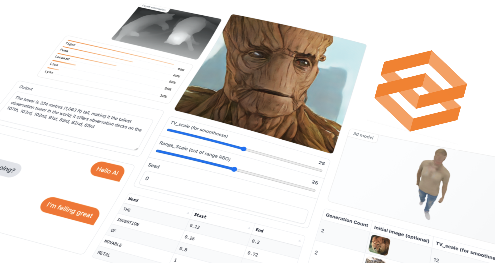

[](https://circleci.com/gh/gradio-app/gradio)  [](https://badge.fury.io/py/gradio)  [](https://codecov.io/gh/gradio-app/gradio) [](https://pypi.org/project/gradio/) [](https://twitter.com/gradio)

#  Gradio: Build Machine Learning Web Apps — in Python

Gradio (pronounced GRAY-dee-oh) is an open-source Python library that is used to build machine learning and data science demos and web applications. 

With Gradio, you can quickly create a beautiful user interface around your machine learning models or data science workflow and let people "try it out" by dragging-and-dropping in their own images, pasting text, recording their own voice, and interacting with your demo, all through the browser.  



Gradio is useful for:

* **Demoing** your machine learning models for clients / collaborators / users / students

* **Deploying** your models quickly with automatic shareable links and getting feedback on model performance

* **Debugging** your model interactively during development using built-in manipulation and interpretation tools

**You can find an interactive version of the following Getting Started at [https://gradio.app/getting_started](https://gradio.app/getting_started).**





##  System Requirements:

Gradio requires Python `3.7+` and has been tested on the latest versions of Windows, MacOS, and various common Linux distributions (e.g. Ubuntu). For Python package requirements, please see the `setup.py` file.

##  Contributing:

If you would like to contribute and your contribution is small, you can directly open a pull request (PR). If you would like to contribute a larger feature, we recommend first creating an issue with a proposed design for discussion. Please see our [contributing guidelines](https://github.com/gradio-app/gradio/blob/master/CONTRIBUTING.md) for more info.

##  License:

Gradio is licensed under the Apache License 2.0


##  See more:

You can find many more examples as well as more info on usage on our website: www.gradio.app

See, also, the accompanying paper: ["Gradio: Hassle-Free Sharing and Testing of ML Models in the Wild"](https://arxiv.org/pdf/1906.02569.pdf), *ICML HILL 2019*, and please use the citation below.

```
@article{abid2019gradio,
title={Gradio: Hassle-Free Sharing and Testing of ML Models in the Wild},
author={Abid, Abubakar and Abdalla, Ali and Abid, Ali and Khan, Dawood and Alfozan, Abdulrahman and Zou, James},
journal={arXiv preprint arXiv:1906.02569},
year={2019}
}
```
